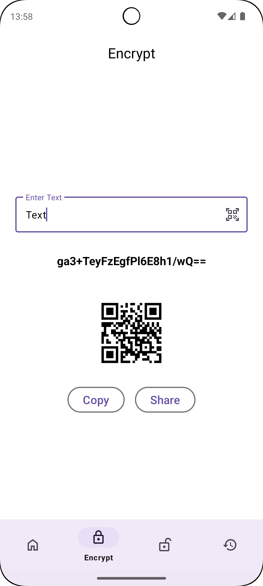
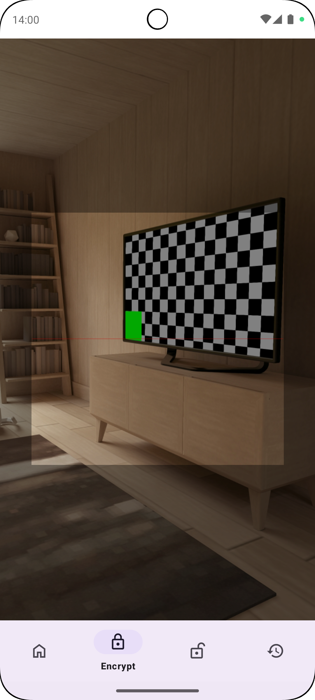

# 🔐 Kriptex

Kriptex is a modern Android app for secure AES-based text encryption and decryption, QR code generation, theme/language selection, and local history tracking.

## 🚀 Features

- 🔒 AES-128 CBC mode encryption & decryption
- 📦 Room database to store encryption/decryption history
- 📷 QR code generation & scanning for encrypted/decrypted text
- 📷 Automatic QR code generation for encrypted/decrypted text
- 🌓 Theme selection: Light / Dark / System default
- 🌍 Language selection: English / Turkish / System default
- 📋 Copy & Share functionality
- 🧠 MVVM architecture with ViewBinding & NavigationComponent
- ✅ Crash reporting with [Firebase Crashlytics](https://firebase.google.com/docs/crashlytics)
- ✅ User behavior analytics with [Firebase Analytics](https://firebase.google.com/docs/analytics)
- ✅ AdMob banner ads

## 📱 Screens

- **Home:** Navigate to Encryption, Decryption, History, or Settings
- **Encryption:** Enter text → encrypt → view result + QR code
- **Decryption:** Enter encrypted text → decrypt → view result + QR code
- **History:** View all stored encryption/decryption records
- **Settings:** Theme and language preferences

## 📸 Screenshots

| Home | Encrypt | Decrypt |
|------|---------|---------|
|  |  |  |
| History | QR Code Scanner |
|  |  |

## 💾 Technologies Used

- Kotlin + Jetpack libraries (Navigation, Room, ViewModel)
- ZXing for QR code generation
- Material Design 3
- MVVM pattern + ViewBinding
- Proguard optimizations

### 🔧 Firebase Setup

> Firebase is used for crash reporting and analytics (no sensitive user data is collected).

To enable Firebase features:
1. Create a Firebase project at [console.firebase.google.com](https://console.firebase.google.com)
2. Register your app using your package name.
3. Download `google-services.json` and place it in the `app/` directory.
4. Sync and run the project.

## 📦 Installation

```bash
git clone https://github.com/mahmutaunal/Kriptex.git
